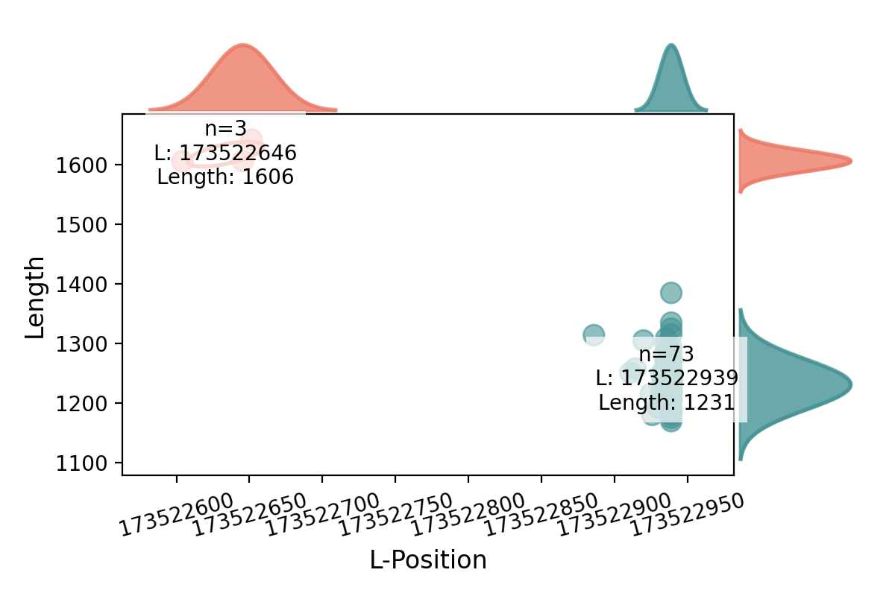

# SV_GMM

This tool is designed to analyze genetic data, determining the number of structural variants in a reading frame using statistical inference.

## Dependencies
### Python
* Tested with python version 3.11.3 and 3.12.10. 
  * If running on Fiji, use `module load python/3.11.3`

### Python packages
* Create a python environment and install the packages listed in the minimum requirements file.
```
python -m venv venv
source venv/bin/activate
pip3 install -r min_requirements.txt
```

* If you have any problems, feel free to refer to the `requirements.txt` file to see the full list of packages used in the paper. 

### STIX
If you need will be providing a STIX database instead of processed read support, you will need to follow STIX download instructions from this [Github](https://github.com/ryanlayer/stix/tree/master). 


## Required Inputs
* Structural Variant coordinates or 1000 Genomes ID
### Files Needed (or added) in Input_Dir
#### A. List of SVs and the genotype of patients
* `--sv_lookup`: Contains the SV information from samples for all the deletions of interest. Can be provided as a **vcf (or vcf.gz) or a comma-delimited file** (details below). If a VCF is provided, the software will create the comma-delimited file for faster next usage instead of the VCF: "deletions.csv"
  * CSV with the columns id, chr, start, stop, svlen, ref, alt, qual, filter, af, info, sample1, ..., sampleN, num_samples
  * info is a python dictionary
  * Example comma-delimited version is deletions.csv in assets/ (part shown below)

  EXAMPLE comma-delimited file version of sv_lookup
  ```
  id,chr,start,stop,svlen,ref,alt,qual,filter,af,info,HG00118,HG00119,num_samples
  HGSV_3,1,39999,107150,67151,N,<DEL>,120.0,['PASS'],0.11301916932907348,"{'SVTYPE': 'DEL', 'CHR2': 'chr1', 'SVLEN': -67150, 'ALGORITHMS': ('depth',), 'EVIDENCE': ('BAF', 'RD'), 'AC': (566,), 'AN': 4016, 'SOURCE': 'gatksv', 'ORIGIN_SVID': ('1KGP_2504_and_698_with_GIAB_DEL_chr1_1',), 'AF': (0.14177699387073517,), 'N_BI_GENOS': 2578, 'N_HOMREF': 2002, 'N_HET': 421, 'N_HOMALT': 155, 'FREQ_HOMREF': 0.7765709757804871, 'FREQ_HET': 0.16330499947071075, 'FREQ_HOMALT': 0.060124099254608154, 'MALE_AN': 2568, 'MALE_AC': (360,), 'MALE_AF': (0.14018699526786804,), 'MALE_N_BI_GENOS': 1284, 'MALE_N_HOMREF': 1003, 'MALE_N_HET': 202, 'MALE_N_HOMALT': 79, 'MALE_FREQ_HOMREF': 0.7811530232429504, 'MALE_FREQ_HET': 0.1573210060596466, 'MALE_FREQ_HOMALT': 0.061526499688625336, 'FEMALE_AN': 2588, 'FEMALE_AC': (371,), 'FEMALE_AF': (0.14335399866104126,), ...'SAN_FEMALE_FREQ_HOMALT': 0.04035869985818863, 'POPMAX_AF': 0.3734019994735718}","(0,0)","(0,1)",2
  ```

#### B. Read-based data
SPLIT uses information of sample read data within a given SV coordinate space to cluster and identify SVs. You can provide this in 3 ways:

1. STIX database/index of CRAMS/BAMS. Please refer to the [STIX github](https://github.com/ryanlayer/stix/tree/master) on how to create this. 
  * If using this approach, you will simply provide the paths to the STIX index (`--stix_index`), STIX database (`--stix_database`), where you store the active software (`-stix_bin`), and the number of shards used to build the database (`--num_stix_shards` which has a default of 1).
  * In this case, SPLIT will query the database for read evidence of an SV for you.

2. Read information already queried from a database in a tab-delimited-file with the naming convention being the same as that of the SV you are testing (e.g. if I'm considering SV chr3:1000-2000 then the file must be named 3:1000-1000_3:2000-2000.txt).
  * Format is tab-delimited file with columns File ID, File Name, Chr, Left Start, Left End, Chr, Right Start, Right End, whether based on Paired or Split reads
  ```
  3	bed_0/HG00122.bed.gz	3	173522849	173522939	3	173524168	173524318	paired
  3	bed_0/HG00122.bed.gz	3	173522873	173522939	3	173524105	173524255	paired
  ```
  * THIS MERITS BETTER EXPLANATION FOR PAIRED VS SPLIT EXAMPLES

3. PROCESSED evidence in a comma-delimited-file with the same naming convention (e.g. if I'm considering SV chr3:1000-2000 then the file must be named 3:1000-1000_3:2000-2000.csv)

  * Format is comma-seperated file with columns Sample, XXXX
  
  ```
  HG00102,173522744,173524280,173522761,173524248,173522840,173524340,173522842,173524369,173522861,173524496,173522862,173524445,173522866,173524347,173522888,173524262
  HG00103,173522759,173524359,173522762,173524364,173522879,173524244,173522885,173524384,173522898,173524299
  HG00110,173522816,173524440,173522826,173524457,173522837,173524327,173522878,173524414,173522884,173524303
  HG00122,173522849,173524318,173522873,173524255,173522881,173524392
  HG00149,173522763,173524247,173522838,173524265
  ```


#### C. Mean insert-sizes of patients (or default=450)
* `insert_sizes`: Provides the mean insert size for the samples to be used in the algorithm. If the file is not provided, a default of 450 is used.

  Example file:
  ```
  sample_id,mean_insert_size
  NA20509,440
  HG02941,436
  ```


## Arguments
```
usage: query_sv.py [-h] [-l L] [-r R] [-id ID] [-p [P]] [-d [D]] [-lr [LR]] [-ref REF] [--input_dir INPUT_DIR] [--output_dir OUTPUT_DIR]
                   [--sv_lookup SV_LOOKUP] [--insert_size_file INSERT_SIZE_FILE] [--stix_bin STIX_BIN] [--stix_index STIX_INDEX]
                   [--stix_database STIX_DATABASE] [--num_stix_shards NUM_STIX_SHARDS]
```

```
Required arguments:
    --l                           Leftmost coordinate of SV (format is chr:Num) (Required if svid not used)
    --r                           Rightmost coordinate of SV (format is chr:Num) (Required if svid not used)
    OR
    --id                          Structural variant id from 1000Genomes Project (Required if l and r not provided)

Directory Paths:
    --input_dir                   path to where the sv_lookup and insert_size files are (default = "assets/")
    --output_dir                  path to where the processed outputs are saved (if None then uses input_dir)  

Input Options:
    --sv_lookup                   name of sv_lookup file in input directory. Can be vcf, vcf.gz, or csv with format described in Required Inputs (default = deletions.csv)
    --insert_size_file            name of file with insert sizes in input directory. Format shown in Inputs (*Optional -- if None provided will use default insert size of 450)
    --ref                         reference genome used (default = grch38)

Processing Flags: 
    -p                           If include then will plot the Length and L-coordinate of each sample
    -d                           If include then will continue to rerun algorithm until acheives ≥ 80% confidence          

Required if running STIX to get related data
    --stix_bin                    path to STIX executable (e.g. "~/stix/bin/stix")
    --stix_index                  path to STIX index -- what used for parameter -i in STIX (e.g. "alt_sort_b")
    --stix_database               path to STIX database -- what used for parameter -d in STIX (e.g. "1kg.ped.db")
    --num_stix_shards             number of stix shards used (default = 1)
  
```

## Output
### Intermediate Files saved to input directory (if not already provided):
* Sv-lookup as csv (if VCF provided): `deletions.csv` (refer to Required Input Files)
* PROCESSED evidence for SV if not already provided

* sv_lookup.csv?????
  ```
  id,chr,start,stop,svlen,af
  HGSV_3,1,39999,107150,67151,0.11301916932907348
  HGSV_22,1,586987,670994,84007,0.04792332268370607
  ```
### Standard Output (printed)
The algorithm will iterate through trials where the outcome refers to the mode number with the greatest probability (probabilities = [probability of 1 mode, probability of 2 modes, probability of 3 modes])
```
Trial 1: outcome=2, probabilities=[0.25 0.5  0.25]
Trial 2: outcome=2, probabilities=[0.2 0.6 0.2]
Trial 3: outcome=2, probabilities=[0.16666667 0.66666667 0.16666667]
Trial 4: outcome=2, probabilities=[0.14285714 0.71428571 0.14285714]
Trial 5: outcome=2, probabilities=[0.125 0.75  0.125]
Trial 6: outcome=2, probabilities=[0.11111111 0.77777778 0.11111111]
Trial 7: outcome=2, probabilities=[0.1 0.8 0.1]
Trial 8: outcome=2, probabilities=[0.09090909 0.81818182 0.09090909]
3:173522965-173524108 - stopping after 8 iterations, 2 modes, ci=[array([0.63104355]), array([0.82350191])]
```

### Plots
If using the flag `-p`, a plot showing the clusters of SVs identified based on length and L-coordinate are shown. Saved in output_directory/plots. Plot you should get from running the test example: 
 


## Test
Test if you can successfully run with `test_run.sh`. This uses a deletions.csv as sv-lookup and queried but unprocessed read evidence. 

You should get the outputs and results shown in "Output" above.


## More details on approach
### How does SPLIT query STIX database for evidence of an SV (e.g. what is in the unprocessed evidence (.txt file))?

* For short-read data (default), queries STIX for all evidence within the region, +- 50 bp from each end of the provided SV
* For long-read data (requires option `-lr`), Parses the cigar string for all available 1kg samples with long-read data
  * From the sample's entire cram file, download the bam file corresponding to an SV region (start - tolerance, stop + tolerance). Look for instances of "D" in the cigar string, corresponding with a deletion in the selected region. Use the size of the original SV +- an additional tolerance to find deletions that match the original SV. Using the reference, calculate the start/stop/length of the deletion.


### How does SPLIT process the queried data?
SPLIT then removes samples with genotypes of (0,0) and summarizes the read-data evidence into paired coordinates for samples (.csv file)
```
HG00096,113799540,113800187\
HG00097,113799542,113800388\
HG00099,113799516,113800321\
HG00100,113799234,113800190,113799235,113800238,113799318,113800230,113799328,113800353,113799349,113800342,113799356,113800259,113799379,113800269,113799403,113800296,113799467,113800440\
HG00101,113799430,113800209,113799529,113800307,113799553,113800389\
```

### How does SPLIT identify clusters/merged SVs?
First, SPLIT merges each read evidence into simple coordinate space. It takes the mean L and mean length of each paired-end read so that each sample is represented as a 2D point (length, L).

Next, it runs the GMM.

It probability determines the points are most likely to fit a 1, 2, or 3 mode distribution. Runs the EM algorithm for 30 iterations for each of the distributions and compares the AIC scores for each model. Any SV with 10 or fewer samples will be marked as "inconclusive".

Finally, it assigns points to the modes if more than 1 SV was found in the region.

<!-- #### Best Distribution Over All Data Points

 -->

## Helpful Results from Paper

#### Left-Right Coordinates of Points for Each Distribution & Ancestry Splits


#### Length of SVs For Each Mode


---

## Synthetic Data Workflow

Synthetic data is generated to test the accuracy of SVeperator and GATK-ClusterBatch with increasing reciprocal overlap, _r_ for five different test cases. The `run_synthetic_data.sh` sbatch script on Fiji runs the `r_accuracy_test` function in `synthetic_tests.py`, varying the sample size and sv length.

```
n_samples_values=(10 21 66 206 313)
svlen_values=(51 167 802 3377 17352)
for n_samples in "${n_samples_values[@]}"; do
  for svlen in "${svlen_values[@]}"; do
    echo "Running with n_samples=$n_samples and svlen=$svlen"
    start_time=$(date +%s)
    python3 "$HOME/sv/sv_gmm/synthetic_tests.py" "$n_samples" "$svlen"
    end_time=$(date +%s)
    elapsed_time=$((end_time - start_time))
    echo "Completed n_samples=$n_samples and svlen=$svlen in $elapsed_time seconds"
  done
done
```

Noise is added to generated data to replicate short-read data, and results are saved in the synthetic_data directory by sample size. The results for a given sample size and sv length can be plotted with the `plot_reciprocal_overlap_all` function in `viz.py`.

## 1kG Data Processing

The data used for this project originates from the 1000 Genomes Project's original 2504 samples. All data is found in the `/scratch/Shares/layer/stix/indices/` directory on fiji. A pre-built [STIX](https://github.com/ryanlayer/stix) index is used to query genomic regions for short and long reads (by sample) that serve as evidence for the SV of interest. Low-coverage short read, high-coverage short read, and long-read data are all available. The deletions that were present in the initial 1kG analysis are found in `1kgp/1kg_hg38_deletions.vcf` or `1kgp/deletions.csv`.

### Low-coverage short-reads

Low-coverage data is supported by not used in the main analysis. Depending on the reference genome, the appropriate STIX index is in the `1kg_hg37_low_cov` or `1kg_hg38_low_cov` directory.

### High-coverage short-reads

High-coverage data is found in the `1kg_high_coverage_vivian` directory.
To run the analysis for a single SV, run `python query_sv.py` with the -id or -l and -r arguments.
To run the pipeline on the entire dataset, run `python run_svs_until_converge.py`. The dirichlet process is run for each SV until "convergence" (we have high confidence in the outcome or 100 trials). A new file is written into the `processed_svs_converge` directory, and the files are concatenated into one large file (`sv_stats_converge.csv`) at the end of the function. The process is parallelized and runs on fiji.

### Long-reads

Long-read data is found in the `LR_vivian` directory. Once the data has been pre-processed, run `python run_lr_until_converge.py` to run the dirichlet process.

### Post-Processing & Figures

After writing the `sv_stats_converge.csv` file, run the `write_post_processed_files` function in `helper.py` to generate several other files useful in downstream analysis.

- `svs_n_modes.csv`: number of modes and confidence predicted for each SV with evidence in STIX
- `sr_lr_merged.csv` (for long reads only): compares the number of modes and the confidence for each SV outcome between short and long read results
- `consensus_svs.csv`: consensus SVs by averaging the start/stop/length of each mode across all runs of the SV
- `sv_stats_collapsed.csv`: SV stats with 1 row for each SV based on the most common SV clustering
- `outliers.csv`: outliers identified based on a threshold
- `ancestry_dissimilarity.csv`: bray curtis dissimilarity calculated between clusters for SVs split into 2+ clusters
- `new_gene_intersections.bed` (needs a working build of bedtools): new gene intersections resulting from the split SVs

### Flowchart Figure

To create the flowchart figure, we need:

- the number of total deletions (from `deletions.csv`)
- the number of SVs with no or too little evidence in STIX (<= 10 samples)
  - no evidence: `deletions_df.shape[0] - svs_n_modes.shape[0]`
  - little evidence: `svs_n_modes[svs_n_modes["confidence"] == "inconclusive"].shape[0]`
  - total number: `deletions_df.shape[0] - svs_n_modes[svs_n_modes["confidence"] != "inconclusive"].shape[0]`
- the number of SVs with an outcome
  - `svs_n_modes[svs_n_modes["confidence"] != "inconclusive"].shape[0]`
- the number of high confidence, medium confidence, and low confidence SVs
  - ex: `svs_n_modes[svs_n_modes["confidence"] == "low"].shape[0]`
- the predicted number of clusters depending on confidence
  - ex: `Counter(svs_n_modes[svs_n_modes["confidence"] == "high"]["num_modes"])`
- the second most likely number of clusters (in low confidence situation)
  - `Counter(svs_n_modes[svs_n_modes["confidence"] == "low"]["num_modes_2"])`
